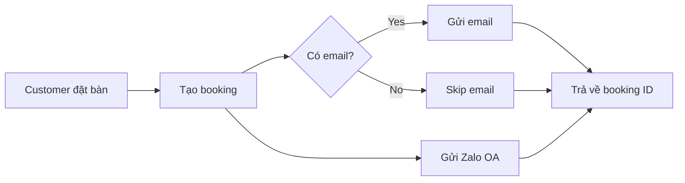

# 📧 Email & Zalo Notification Setup Guide

## Email Setup (Gmail)

### Bước 1: Chuẩn bị Gmail account
1. Sử dụng Gmail account của Lang Sake (ví dụ: booking@langsake.vn)
2. Bật **2-Step Verification** tại: https://myaccount.google.com/security

### Bước 2: Tạo App Password
1. Vào: https://myaccount.google.com/apppasswords
2. Chọn **App**: Mail
3. Chọn **Device**: Other (Custom name) → nhập "Lang Sake Booking System"
4. Click **Generate**
5. Copy password 16 ký tự (không có dấu cách)

### Bước 3: Cấu hình .env
```env
EMAIL_USER=booking@langsake.vn
EMAIL_PASSWORD=abcd efgh ijkl mnop
```

### Bước 4: Test email
```bash
npm run test:email
```

---

## Zalo OA Setup

### Bước 1: Tạo Zalo Official Account
1. Vào: https://oa.zalo.me/
2. Đăng ký Zalo OA cho Lang Sake
3. Chờ phê duyệt (1-2 ngày)

### Bước 2: Lấy Access Token
1. Vào Developer Console: https://developers.zalo.me/
2. Tạo app mới hoặc chọn app hiện có
3. Vào **Settings** → **Official Account** → Liên kết OA
4. Copy **Access Token** (dài khoảng 200 ký tự)

### Bước 3: Cấu hình .env
```env
ZALO_ACCESS_TOKEN=your-very-long-access-token-here
```

### Bước 4: Add test phone numbers
- Zalo OA cần follower mới có thể gửi tin
- Test mode: chỉ gửi được cho số admin
- Production mode: gửi được cho tất cả follower

### Bước 5: Template Message (Optional)
Để gửi template message đẹp hơn:
1. Vào Zalo OA Dashboard → **Broadcast Message** → **Template**
2. Tạo template với các placeholder:
   - `{{booking_code}}`
   - `{{customer_name}}`
   - `{{date_time}}`
   - `{{total_amount}}`
3. Chờ Zalo phê duyệt template
4. Copy Template ID vào code

---

## Notification Flow



### Email Content
- ✅ HTML email với branding
- ✅ Mã booking code (8 ký tự)
- ✅ Chi tiết booking đầy đủ
- ✅ Link tra cứu booking
- ✅ Hướng dẫn check-in

### Zalo OA Content
- ✅ Text message ngắn gọn
- ✅ Mã booking code
- ✅ Thông tin cơ bản
- ✅ Link tra cứu

---

## Testing

### Test Email
```typescript
// src/app/api/test/email/route.ts
import { sendBookingConfirmationEmail } from "@/lib/email";

export async function GET() {
  const result = await sendBookingConfirmationEmail({
    bookingId: "test123456",
    customerName: "Nguyễn Văn A",
    customerEmail: "test@example.com",
    phone: "0901234567",
    dateTime: new Date().toISOString(),
    guests: 4,
    comboName: "Combo Gia Đình",
    finalTotal: 2400000,
    depositAmount: 240000,
    discount: 0,
  });
  
  return Response.json(result);
}
```

### Test Zalo
```typescript
// src/app/api/test/zalo/route.ts
import { sendZaloOABookingConfirmation } from "@/lib/zalo";

export async function GET() {
  const result = await sendZaloOABookingConfirmation({
    bookingId: "test123456",
    customerName: "Nguyễn Văn A",
    phone: "0901234567",
    dateTime: new Date().toISOString(),
    guests: 4,
    comboName: "Combo Gia Đình",
    finalTotal: 2400000,
    depositAmount: 240000,
  });
  
  return Response.json(result);
}
```

---

## Troubleshooting

### Email không gửi được
- ❌ Check EMAIL_USER và EMAIL_PASSWORD trong .env
- ❌ Verify App Password đã tạo đúng
- ❌ Check 2-Step Verification đã bật
- ❌ Xem console log để biết lỗi cụ thể

### Zalo không gửi được
- ❌ Check ZALO_ACCESS_TOKEN trong .env
- ❌ Verify OA đã được phê duyệt
- ❌ Check follower đã follow OA chưa
- ❌ Test mode: chỉ gửi được cho admin phone

### Booking vẫn tạo được dù email/Zalo fail
- ✅ Đúng rồi! Notification failure không làm fail booking
- ✅ System ghi log error để admin biết
- ✅ Customer vẫn nhận được mã booking trên web

---

## Production Checklist

- [ ] Gmail account chuyên dụng cho booking
- [ ] App Password đã tạo và test
- [ ] Zalo OA đã verify và có follower
- [ ] Template messages đã được phê duyệt
- [ ] Test gửi email thành công
- [ ] Test gửi Zalo thành công
- [ ] Monitor error logs
- [ ] Setup email/Zalo quota alerts
